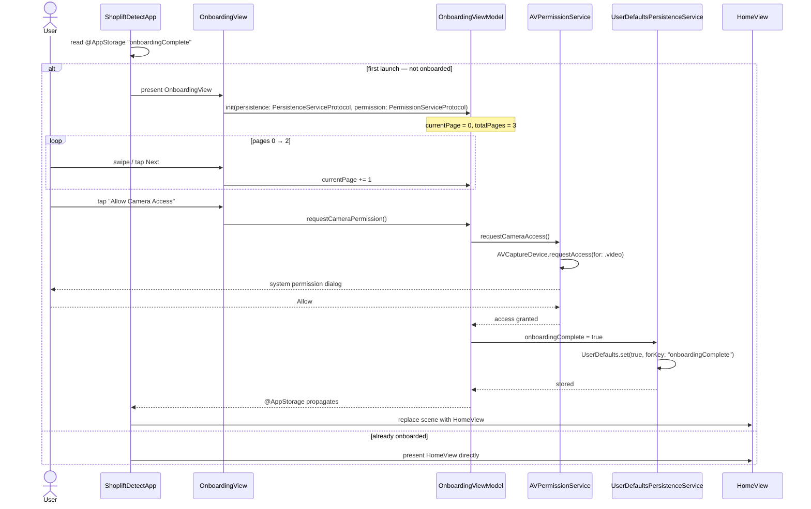
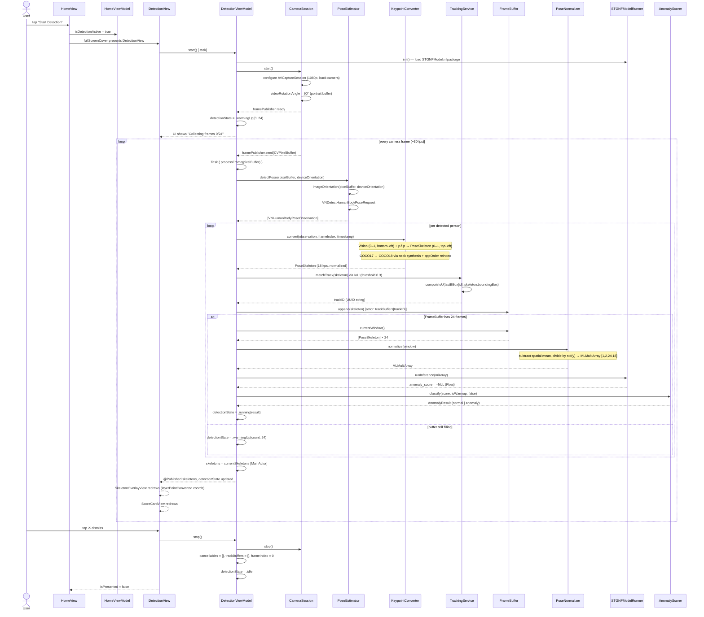
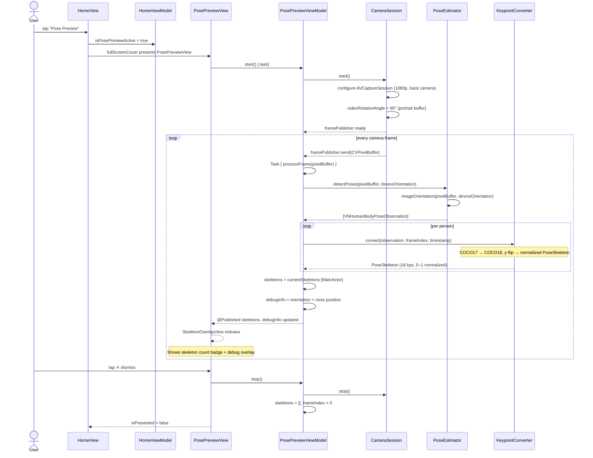

# iOS App — Sequence Diagrams

---

## 1. App Startup & Onboarding

```mermaid
sequenceDiagram
    actor User
    participant App  as ShopliftDetectApp
    participant OV   as OnboardingView
    participant OVM  as OnboardingViewModel
    participant PS   as AVPermissionService
    participant PES  as UserDefaultsPersistenceService
    participant HV   as HomeView

    App->>App: read @AppStorage "onboardingComplete"

    alt first launch — not onboarded
        App->>OV: present OnboardingView
        OV->>OVM: init(persistence: PersistenceServiceProtocol, permission: PermissionServiceProtocol)
        Note over OVM: currentPage = 0, totalPages = 3

        loop pages 0 → 2
            User->>OV: swipe / tap Next
            OV->>OVM: currentPage += 1
        end

        User->>OV: tap "Allow Camera Access"
        OV->>OVM: requestCameraPermission()
        OVM->>PS: requestCameraAccess()
        PS->>PS: AVCaptureDevice.requestAccess(for: .video)
        PS-->>User: system permission dialog
        User-->>PS: Allow
        PS-->>OVM: access granted
        OVM->>PES: onboardingComplete = true
        PES->>PES: UserDefaults.set(true, forKey: "onboardingComplete")
        PES-->>OVM: stored
        OVM-->>App: @AppStorage propagates
        App->>HV: replace scene with HomeView

    else already onboarded
        App->>HV: present HomeView directly
    end
```

---

## 2. Detection Session — Frame Inference Loop

```mermaid
sequenceDiagram
    actor User
    participant HV  as HomeView
    participant HVM as HomeViewModel
    participant DV  as DetectionView
    participant DVM as DetectionViewModel
    participant CS  as CameraSession
    participant PE  as PoseEstimator
    participant KC  as KeypointConverter
    participant TS  as TrackingService
    participant FB  as FrameBuffer
    participant PN  as PoseNormalizer
    participant MR  as STGNFModelRunner
    participant AS  as AnomalyScorer

    User->>HV: tap "Start Detection"
    HV->>HVM: isDetectionActive = true
    HV->>DV: fullScreenCover presents DetectionView

    DV->>DVM: start() [.task]
    DVM->>MR: init() — load STGNFModel.mlpackage
    DVM->>CS: start()
    CS->>CS: configure AVCaptureSession (1080p, back camera)
    CS->>CS: videoRotationAngle = 90° (portrait buffer)
    CS-->>DVM: framePublisher ready
    DVM->>DVM: detectionState = .warmingUp(0, 24)
    DVM-->>DV: UI shows "Collecting frames 0/24"

    loop every camera frame (~30 fps)
        CS-->>DVM: framePublisher.send(CVPixelBuffer)
        DVM->>DVM: Task { processFrame(pixelBuffer) }

        DVM->>PE: detectPoses(pixelBuffer, deviceOrientation)
        PE->>PE: imageOrientation(pixelBuffer, deviceOrientation)
        PE->>PE: VNDetectHumanBodyPoseRequest
        PE-->>DVM: [VNHumanBodyPoseObservation]

        loop per detected person
            DVM->>KC: convert(observation, frameIndex, timestamp)
            Note over KC: Vision (0–1, bottom-left) + y-flip → PoseSkeleton (0–1, top-left)
            Note over KC: COCO17 → COCO18 via neck synthesis + oppOrder reindex
            KC-->>DVM: PoseSkeleton (18 kps, normalized)

            DVM->>TS: matchTrack(skeleton) via IoU (threshold 0.3)
            TS->>TS: computeIoU(lastBBox[id], skeleton.boundingBox)
            TS-->>DVM: trackID (UUID string)
            DVM->>FB: append(skeleton)  [actor: trackBuffers[trackID]]

            alt FrameBuffer has 24 frames
                DVM->>FB: currentWindow()
                FB-->>DVM: [PoseSkeleton] × 24
                DVM->>PN: normalize(window)
                Note over PN: subtract spatial mean, divide by std(y) → MLMultiArray [1,2,24,18]
                PN-->>DVM: MLMultiArray
                DVM->>MR: runInference(mlArray)
                MR-->>DVM: anomaly_score = –NLL (Float)
                DVM->>AS: classify(score, isWarmup: false)
                AS-->>DVM: AnomalyResult (normal | anomaly)
                DVM->>DVM: detectionState = .running(result)
            else buffer still filling
                DVM->>DVM: detectionState = .warmingUp(count, 24)
            end
        end

        DVM->>DVM: skeletons = currentSkeletons [MainActor]
        DVM-->>DV: @Published skeletons, detectionState updated
        DV-->>DV: SkeletonOverlayView redraws (layerPointConverted coords)
        DV-->>DV: ScoreCardView redraws
    end

    User->>DV: tap ✕ dismiss
    DV->>DVM: stop()
    DVM->>CS: stop()
    DVM->>DVM: cancellables = [], trackBuffers = [], frameIndex = 0
    DVM->>DVM: detectionState = .idle
    DV-->>HV: isPresented = false
```

---

## 3. Pose Preview Session

```mermaid
sequenceDiagram
    actor User
    participant HV  as HomeView
    participant HVM as HomeViewModel
    participant PV  as PosePreviewView
    participant PVM as PosePreviewViewModel
    participant CS  as CameraSession
    participant PE  as PoseEstimator
    participant KC  as KeypointConverter

    User->>HV: tap "Pose Preview"
    HV->>HVM: isPosePreviewActive = true
    HV->>PV: fullScreenCover presents PosePreviewView

    PV->>PVM: start() [.task]
    PVM->>CS: start()
    CS->>CS: configure AVCaptureSession (1080p, back camera)
    CS->>CS: videoRotationAngle = 90° (portrait buffer)
    CS-->>PVM: framePublisher ready

    loop every camera frame
        CS-->>PVM: framePublisher.send(CVPixelBuffer)
        PVM->>PVM: Task { processFrame(pixelBuffer) }
        PVM->>PE: detectPoses(pixelBuffer, deviceOrientation)
        PE->>PE: imageOrientation(pixelBuffer, deviceOrientation)
        PE-->>PVM: [VNHumanBodyPoseObservation]

        loop per person
            PVM->>KC: convert(observation, frameIndex, timestamp)
            Note over KC: COCO17 → COCO18, y-flip → normalized PoseSkeleton
            KC-->>PVM: PoseSkeleton (18 kps, 0–1 normalized)
        end

        PVM->>PVM: skeletons = currentSkeletons [MainActor]
        PVM->>PVM: debugInfo = orientation + nose position
        PVM-->>PV: @Published skeletons, debugInfo updated
        PV-->>PV: SkeletonOverlayView redraws
        Note over PV: Shows skeleton count badge + debug overlay
    end

    User->>PV: tap ✕ dismiss
    PV->>PVM: stop()
    PVM->>CS: stop()
    PVM->>PVM: skeletons = [], frameIndex = 0
    PV-->>HV: isPresented = false
```
