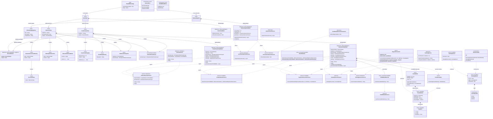

# iOS App — Class Diagram

```mermaid
classDiagram
    %% ─── App Layer ───────────────────────────────────────────────────────────
    class ShopliftDetectApp {
        <<App>>
        -onboardingComplete : Bool
        +body : Scene
    }
    class DeviceRotation {
        <<MainActor, ObservableObject, singleton>>
        +shared : DeviceRotation$
        +angle : Angle
    }

    %% ─── Views ───────────────────────────────────────────────────────────────
    class HomeView {
        <<View>>
    }
    class OnboardingView {
        <<View>>
    }
    class OnboardingPageView {
        <<View>>
        +title : String
        +description : String
        +imageName : String
    }
    class DetectionView {
        <<View>>
        -startError : String?
        -isPreviewUITest : Bool
        -rotation : DeviceRotation
    }
    class DetectionScoreCardOverlay {
        <<View>>
        +state : DetectionState
        +rotation : Angle
    }
    class WarmupIndicatorView {
        <<View>>
        +state : DetectionState
        +rotation : Angle
    }
    class DetectionDismissButton {
        <<View>>
        +rotation : Angle
        +action : () → Void
    }
    class PosePreviewView {
        <<View>>
        -startError : String?
        -rotation : DeviceRotation
    }
    class PosePreviewTopBar {
        <<View>>
        +skeletonCount : Int
        +rotation : Angle
        +onDismiss : () → Void
    }
    class PoseDebugOverlay {
        <<View>>
        +debugInfo : String
    }
    class SkeletonOverlayView {
        <<View>>
        +skeletons : [PoseSkeleton]
        +previewLayer : AVCaptureVideoPreviewLayer
    }
    class ScoreCardView {
        <<View>>
        +state : DetectionState
    }
    class CameraPreviewLayer {
        <<UIViewRepresentable>>
        +previewLayer : AVCaptureVideoPreviewLayer
    }

    %% ─── ViewModels ──────────────────────────────────────────────────────────
    class HomeViewModel {
        <<MainActor, ObservableObject>>
        +isDetectionActive : Bool
        +isPosePreviewActive : Bool
    }
    class OnboardingViewModel {
        <<MainActor, ObservableObject>>
        +currentPage : Int
        +totalPages : Int
        -persistence : PersistenceServiceProtocol
        -permission : PermissionServiceProtocol
        +requestCameraPermission() async
        +complete()
    }
    class DetectionViewModel {
        <<MainActor, ObservableObject>>
        +detectionState : DetectionState
        +skeletons : [PoseSkeleton]
        +previewLayer : AVCaptureVideoPreviewLayer
        -camera : CameraSessionProtocol
        -estimator : PoseEstimatorProtocol
        -converter : KeypointConverterProtocol
        -scorer : AnomalyScorerProtocol
        -tracking : TrackingServiceProtocol
        +start() throws
        +stop()
        +enablePreviewTestMode()
        -processFrame(CVPixelBuffer) async
    }
    class PosePreviewViewModel {
        <<MainActor, ObservableObject>>
        +skeletons : [PoseSkeleton]
        +debugInfo : String
        +previewLayer : AVCaptureVideoPreviewLayer
        -camera : CameraSessionProtocol
        -estimator : PoseEstimatorProtocol
        -converter : KeypointConverterProtocol
        +start() throws
        +stop()
        -processFrame(CVPixelBuffer) async
    }

    %% ─── Service Protocols ───────────────────────────────────────────────────
    class CameraSessionProtocol {
        <<protocol, MainActor>>
        +framePublisher : AnyPublisher~CVPixelBuffer~
        +previewLayer : AVCaptureVideoPreviewLayer
        +start() throws
        +stop()
    }
    class PoseEstimatorProtocol {
        <<protocol, Sendable>>
        +detectPoses(CVPixelBuffer, UIDeviceOrientation) [VNHumanBodyPoseObservation]
    }
    class KeypointConverterProtocol {
        <<protocol, Sendable>>
        +convert(VNHumanBodyPoseObservation, Int, CMTime) PoseSkeleton
    }
    class AnomalyScorerProtocol {
        <<protocol>>
        +classify(Float, Bool) AnomalyResult
    }
    class STGNFModelProtocol {
        <<protocol>>
        +runInference(MLMultiArray) Float
    }
    class PermissionServiceProtocol {
        <<protocol, MainActor>>
        +requestCameraAccess() async
    }
    class PersistenceServiceProtocol {
        <<protocol, MainActor>>
        +onboardingComplete : Bool
    }
    class TrackingServiceProtocol {
        <<protocol, MainActor>>
        +matchTrack(PoseSkeleton) String
    }

    %% ─── Service Implementations ─────────────────────────────────────────────
    class CameraSession {
        <<MainActor, NSObject>>
        +previewLayer : AVCaptureVideoPreviewLayer
        +framePublisher : AnyPublisher~CVPixelBuffer~
        +start() throws
        +stop()
    }
    class PoseEstimator {
        <<class, unchecked Sendable>>
        +detectPoses(CVPixelBuffer, UIDeviceOrientation) [VNHumanBodyPoseObservation]
        +imageOrientation(CVPixelBuffer, UIDeviceOrientation) CGImagePropertyOrientation$
    }
    class KeypointConverter {
        <<struct>>
        +oppOrder : [Int]$
        +coco17Joints : [JointName]$
        +convert(VNHumanBodyPoseObservation, Int, CMTime) PoseSkeleton
        +selectNeck(Keypoint?, Keypoint, Keypoint) Keypoint$
        +reorder([Keypoint], Keypoint) [Keypoint]$
    }
    class PoseNormalizer {
        <<struct>>
        +normalize([PoseSkeleton]) MLMultiArray
    }
    class AnomalyScorer {
        <<struct, Sendable>>
        +threshold : Float
        +classify(Float, Bool) AnomalyResult
    }
    class FrameBuffer {
        <<actor>>
        +capacity : Int = 24$
        +isReady : Bool
        +count : Int
        +append(PoseSkeleton)
        +currentWindow() [PoseSkeleton]?
        +reset()
    }
    class STGNFModelRunner {
        <<class, unchecked Sendable>>
        +runInference(MLMultiArray) Float
    }
    class TrackingService {
        <<MainActor>>
        -iouThreshold : CGFloat = 0.3
        +matchTrack(PoseSkeleton) String
        -computeIoU(CGRect, CGRect) CGFloat
    }
    class AVPermissionService {
        <<final class>>
        +requestCameraAccess() async
    }
    class UserDefaultsPersistenceService {
        <<final class>>
        +onboardingComplete : Bool
    }

    %% ─── Domain Models ───────────────────────────────────────────────────────
    class Keypoint {
        <<struct, Sendable>>
        +x : Float
        +y : Float
        +confidence : Float
    }
    class PoseSkeleton {
        <<struct, Sendable>>
        +keypoints : [Keypoint]
        +frameIndex : Int
        +timestamp : CMTime
        +boundingBox : CGRect
    }
    class AnomalyResult {
        <<struct, Sendable>>
        +score : Float
        +label : AnomalyLabel
        +timestamp : Date
    }
    class AnomalyLabel {
        <<enumeration>>
        normal
        anomaly
        warmup
    }
    class DetectionState {
        <<enumeration>>
        idle
        warmingUp(framesCollected, framesNeeded)
        running(latestResult)
        error(reason)
    }
    class CameraError {
        <<enumeration, Error>>
        permissionDenied
        deviceUnavailable
        outputUnavailable
    }
    class STGNFModelError {
        <<enumeration, Error>>
        modelNotFound
        outputMissing
    }

    %% ─── App → View routing ──────────────────────────────────────────────────
    ShopliftDetectApp --> HomeView       : if onboarded
    ShopliftDetectApp --> OnboardingView : if not onboarded

    %% ─── View → ViewModel ownership ─────────────────────────────────────────
    HomeView       *-- HomeViewModel       : @StateObject
    OnboardingView *-- OnboardingViewModel : @StateObject
    DetectionView  *-- DetectionViewModel  : @StateObject
    PosePreviewView *-- PosePreviewViewModel : @StateObject

    %% ─── View navigation ─────────────────────────────────────────────────────
    HomeView --> DetectionView   : fullScreenCover
    HomeView --> PosePreviewView : fullScreenCover
    OnboardingView --> OnboardingPageView : contains pages

    %% ─── View composition ────────────────────────────────────────────────────
    DetectionView  --> CameraPreviewLayer        : renders
    DetectionView  --> SkeletonOverlayView       : renders
    DetectionView  --> DetectionScoreCardOverlay : renders
    DetectionView  --> WarmupIndicatorView       : renders
    DetectionView  --> DetectionDismissButton    : renders
    DetectionView  --> DeviceRotation            : @ObservedObject
    DetectionScoreCardOverlay --> ScoreCardView  : renders
    PosePreviewView --> CameraPreviewLayer   : renders
    PosePreviewView --> SkeletonOverlayView  : renders
    PosePreviewView --> PosePreviewTopBar    : renders
    PosePreviewView --> PoseDebugOverlay     : renders
    PosePreviewView --> DeviceRotation       : @ObservedObject

    %% ─── ViewModel → Service protocol dependencies ───────────────────────────
    DetectionViewModel  ..> CameraSessionProtocol   : injects
    DetectionViewModel  ..> PoseEstimatorProtocol   : injects
    DetectionViewModel  ..> KeypointConverterProtocol : injects
    DetectionViewModel  ..> AnomalyScorerProtocol   : injects
    DetectionViewModel  ..> TrackingServiceProtocol : injects
    DetectionViewModel  *-- STGNFModelRunner        : owns (lazy)
    DetectionViewModel "1" *-- "0..*" FrameBuffer   : trackBuffers[trackID]

    PosePreviewViewModel ..> CameraSessionProtocol    : injects
    PosePreviewViewModel ..> PoseEstimatorProtocol    : injects
    PosePreviewViewModel ..> KeypointConverterProtocol : injects

    OnboardingViewModel ..> PersistenceServiceProtocol : injects
    OnboardingViewModel ..> PermissionServiceProtocol  : injects

    %% ─── Protocol conformance ────────────────────────────────────────────────
    CameraSession              ..|> CameraSessionProtocol
    PoseEstimator              ..|> PoseEstimatorProtocol
    KeypointConverter          ..|> KeypointConverterProtocol
    AnomalyScorer              ..|> AnomalyScorerProtocol
    STGNFModelRunner           ..|> STGNFModelProtocol
    TrackingService            ..|> TrackingServiceProtocol
    AVPermissionService        ..|> PermissionServiceProtocol
    UserDefaultsPersistenceService ..|> PersistenceServiceProtocol

    %% ─── Service → Domain ────────────────────────────────────────────────────
    KeypointConverter ..> PoseSkeleton  : produces
    PoseSkeleton       *-- Keypoint     : 18 keypoints
    AnomalyScorer      ..> AnomalyResult : produces
    AnomalyResult      *-- AnomalyLabel  : label
    DetectionState     ..> AnomalyResult : running case
    FrameBuffer        *-- PoseSkeleton  : rolling window
    PoseNormalizer     ..> PoseSkeleton  : consumes
    DetectionViewModel ..> PoseNormalizer : uses per window
```
